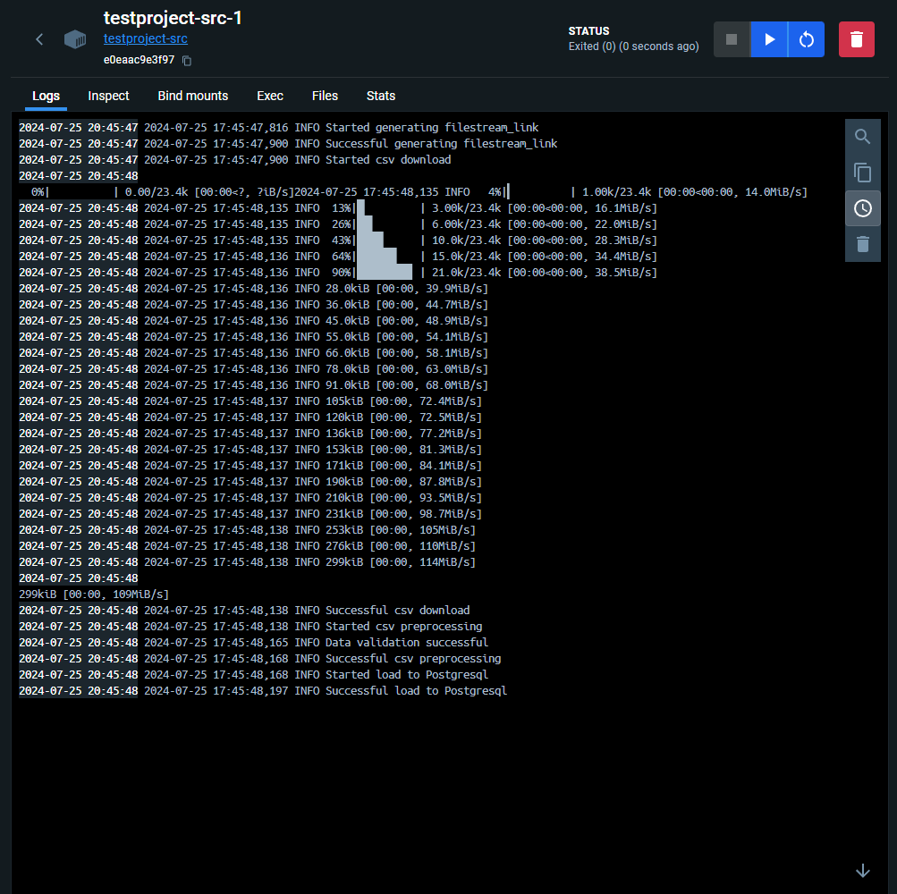
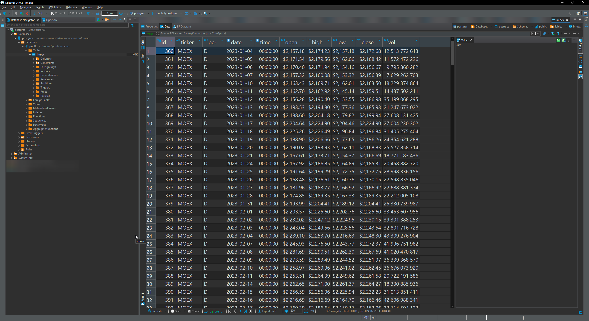
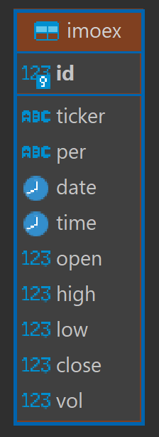

# Тестовое задание по практикуму DWH

## Содержание:
- [Описание](#описание)
- [Демонстрация](#демонстрация)
- [Установка](#установка)
- [Схема БД](#схема-бд)
- [Как это работает](#как-это-работает)

### Описание

Загрузчик данных в БД PostgreSQL на языке Python. 

По публичной ссылке к csv файлу на облаке mail.ru генерирует, забирает его, проводит небольшую предобработку и загружает в БД, логируя эти шаги. 

> [!NOTE]
> На протяжении всего readme будет много размышлений и рассуждений о том, как я выполнял ТЗ. Получилось неидеально, но это мой первый опыт:) Не стал полировать до недостижимого идеала. Инструмент должен выполнять свою задачу и с некоторым задатком на масштабируемость.

### Демонстрация

Логи контейнера с Python скриптом:



Результат загрузки:



### Установка

0. Предполагается, что у вас установлен <code>docker</code>.
1. Склонируйте репозиторий
```
git clone https://github.com/dekir007/TestProject
```

> [!NOTE]
> Если у вас нет инструмента для работы с git, просто скачайте репозиторий по зеленой кнопке Code -> Download ZIP

2. Настройте <code>.env</code> файл на уровне папки <code>TestProject</code> 

Вот этот файл:
```
TestProject/
│
├── src/
│   └── ...
├── initdb/
│   └── ...
├── ...
├── .env
└── ...
```

> [!WARNING]
> Рекомендуется заменить название БД, имя и пароль <code>superuser</code> и <code>testproject</code> пользователя, через которого скрипт будет подключаться к БД, на свои!

Необходимые переменные окружения:
```
DBNAME='postgres'
POSTGRES_USER='postgres'
POSTGRES_PASSWORD='postgres'
PORT='5432'
TESTPROJECT_USER='testproject'
TESTPROJECT_PASSWORD='123123'
```
3. Настройте <code>.env</code> файл на уровне папки <code>src</code>

Вот этот файл:
```
TestProject/
│
├── src/
│   ├── .env
│   └── ...
├── initdb/
│   └── ...
└── ...
```

Здесь <code>POSTGRES_USER</code> и <code>POSTGRES_PASSWORD</code> используются для python скрипта. То есть подставляем сюда значения из <code>TESTPROJECT_USER</code> и <code>TESTPROJECT_PASSWORD</code> из пункта выше.

> [!IMPORTANT]
> Именно здесь задается публичная ссылка на облако!

> [!IMPORTANT]
> Если вы используете свой csv файл, то будет необходимо либо написать схему валидации в функции <code>validate_dataframe</code>, либо убрать ее вызов в функции <code>preprocess_csv</code>! А также необходимо либо переписать, либо убрать параметры, относящиеся к столбцам и, возможно, кодировке, в <code>pd.read_csv</code> в <code>preprocess_csv</code> и в <code>columns</code>  в <code>cur.copy_from</code>  в функции <code>load_df_values_to_postgres</code>.

Необходимые переменные окружения:
```
DBNAME='postgres'
POSTGRES_USER='testproject'
POSTGRES_PASSWORD='123123'
HOST='db'
PORT='5432'
URL='https://cloud.mail.ru/public/L1xB/nvgHGYJz5'
```

> [!NOTE]
> Да, неприятное дублирование, я пробовал сделать один файл. Первый из 2-го пункта использует докер, а этот нужен для скрипта. И проблема в том, что в Dockerfile нельзя прописать COPY .env, он его не копирует! Буду благодарен, если скажите, почему.

4. В консоли на уровне папки <code>TestProject</code> пропишите:

```
docker-compose up
```

После чего поднимутся 2 контейнера: БД и скрипт, который сразу выполнится. Логи выполнения можно увидеть сразу в консоли, потому что мы не прописали флаг <code>-d</code>, запускающий в фоновом режиме. 

> [!TIP]
> Этот проект буквально мой первый опыт работы с докером. Слышал, что ожидание python контейнера поднятия БД контейнера не гарантирует, что БД будет сразу доступна (какое-то время будет инициализация или что-то еще, соединение не будет открыто). Поэтому прописывают bash скрипты для проверки, поднялась ли БД. Взял эту технику [отсюда](https://youtu.be/jCvmvWgKKSw&t=395). UPD: оказалось, это правда помогает!

5. Если вы используете ту же таблицу imoex, пропускайте этот пункт. Иначе зайдите в файл <code>create_table.sql</code> и замените запрос создания моей таблицы на свою.   

### Схема БД



Скрипт создания таблицы <code>imoex</code> (сделал DBeaver):

```
CREATE TABLE public.imoex (
        id serial4 NOT NULL,
        ticker varchar NOT NULL,
        per bpchar(1) NOT NULL,
        "date" date NOT NULL,
        "time" time NOT NULL,
        "open" money NOT NULL,
        high money NOT NULL,
        low money NOT NULL,
        "close" money NOT NULL,
        vol int8 NOT NULL,
        CONSTRAINT imoex_pk PRIMARY KEY (id)
    );
```

> [!NOTE]
> Добавил простой автоинкрементный ключ, а не пытался делать составные ключи, потому что преподаватель в университете говорил, что при миграции могут быть проблемы. Да и банально проще так. 

> [!NOTE]
> Но если выделять primary key только из существующих столбцов, то на основании имеющихся данных это составной из TICKER + DATE. Но тогда лучше их вытащить в отдельную таблицу, а в этой оставить id от ticker_date. И еще надо решить что-то с PER, потому что, к сожалению, я не понял, что это и зачем. Может, тоже войдет в новую таблицу. Или же можно вообще было оставить все в одной таблице, но id будет хэшем от составного ключа. 

> [!NOTE]
> Да, можно было бы делить этот csv, но чтобы делить, надо понимать цели и потребности, как будет эта БД использоваться. А я даже, что такое PER не знаю:)

### Как это работает

Создаются 2 докер контейнера: PostgreSQL и Python окружение. 

#### PostgreSQL

Так как по условию задания было необходимо создать пользователя с надлежащими правами доступа, я создал папку initdb, в которой лежит sql скрипт, вызываемый в пункте command в docker-compose.yaml. 

Постарался сделать этот скрипт с переменными окружения, но это заставило меня скачать дополнительные пакеты в контейнер с БД ради <code>envsubst</code>.

> [!NOTE]
> Загадка, почему скрипт срабатывает даже у меня на компьютере, а не только в контейнере. Потому что откуда файл <code>create_user.sql</code> появляется, я не знаю.

#### Python скрипт

Порядок выполнения:

- Функция <code>get_filestream_link</code> с помощью [кода из этого модуля](https://github.com/aratakileo/mailru-cloud-guest-api-wrapper) создает временную ссылку на скачивание файла. 
- Затем эта ссылка передается в функцию <code>download_csv</code>, где в потоковом режиме скачивается файл, а также в консоль логируется прогресс благодаря <code>tqdm</code>. 
- После этого файл уходит в предобработку в функцию <code>preprocess_csv</code>, где csv превращается в pandas <code>dataframe</code>, который валидируется с помощью pandera в функции <code>validate_dataframe</code>. Если валидация прошла успешно, столбец с датой превращается из ГГММДД в ГГГГ-ММ-ДД.
- После этого данные dataframe передаются в <code>load_to_postgresql</code>, где создается соединение через функцию <code>get_postgres_connection</code>, затем проверяется наличие таблицы imoex в БД с помощью функции <code>create_table_imoex_if_not_found</code>. При ее отсутствии выполняется ее создание. Если таблица есть, она очищается.
- После этого записываются данные через функцию <code>load_df_values_to_postgres</code> по самому быстрому методу [по версии этой статьи](https://ellisvalentiner.com/post/a-fast-method-to-insert-a-pandas-dataframe-into-postgres/)
  
Также настроено логирование каждого шага, ошибок в них и корректное завершение программы.

### Полезные ссылки

- [MailRu Cloud Guest API Wrapper](https://github.com/aratakileo/mailru-cloud-guest-api-wrapper)
- [Как быстро вставить pandas dataframe в PostgreSQL](https://ellisvalentiner.com/post/a-fast-method-to-insert-a-pandas-dataframe-into-postgres/)
- [Настройка ожидания открытия соединения PostgreSQL](https://youtu.be/jCvmvWgKKSw&t=395)